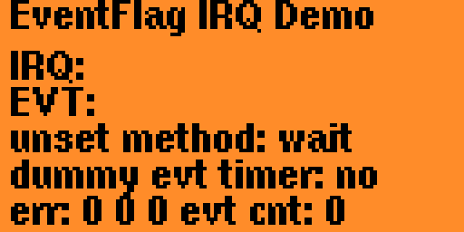

# Flipper eventflag_demo

This app handles GPIO interrupts by delegating the events to an
`FuriEventLoop` with
[furi_event_loop_subscribe_event_flag](https://developer.flipper.net/flipperzero/doxygen/event__loop_8h.html#a28211535228a5b5d5f6d96e6b87b136f).

The application sets interrupts for the left and right input GPIOs.
When a button is pressed, the interrupt writes the `L` or `R`
letters into a buffer„and calls `furi_event_loop_set`. Then the
handler in the event loop gets the flags with either
`furi_event_flag_wait` or `furi_event_flag_clear`, and based on the
received flags, it appends the same `L` or `R` character to
another buffer. These buffers are printed to the gui. I have
the same problem with other interrupts too.

Interestingly, it seems that every
[furi_event_flag_set](https://developer.flipper.net/flipperzero/doxygen/event__flag_8h.html#aa8dfebb078a9aa0aaddf1d5592854ec6)
event is delayed, and is delivered after the very next `set` to the
same `FuriEventFlag`. I only call `furi_event_flag_set` methods from
interrupts.

After the very first `set` the `FuriEventLoop` does not wake up,
and then somehow on every subsequent `set` it wakes up, and
when the `handler` runs and gets the new flag value, it
receives exactly the previous value.

I attempted to keep the example as basic as possible. I am using a
periodic timer to redraw the text unconditionally to make sure the
problem is not in my gui programming. Originally I encountered this
when implementing an app using USB CDC, I encountered freezes, and
managed to compe up with this minimal example to demonstrate the
behavior.

I couldn't figure out how to restart the input service, so
the left and right buttons remain out of operation after the
demo is ran, and you have to reboot. Press the back button
for 20 seconds. Sorry.
